# tecem-2024-02
Tecnologias Emergentes

## Chatbots

### Acesso IBM Cloud

- Cadastro `IBM Academic Initiative`

    [IBM Academic Initiative](https://github.com/academic-initiative/documentation/blob/main/academic-initiative/how-to/How-to-register-with-the-IBM-Academic-Initiative/readme.md)

- Obter promocode para a `IBM Cloud`

    [IBM Cloud Promocode](https://github.com/academic-initiative/documentation/blob/main/academic-initiative/how-to/How-to-request-and-IBM-Cloud-Feature-Code/readme.md)

- Ativar `IBM Cloud`

    [IBM Cloud](https://github.com/academic-initiative/documentation/blob/main/academic-initiative/how-to/How-to-create-an-IBM-Cloud-account/readme.md)

### Language Translator

- Acesso via `postman`
    - Utilizar a URL `https://api.us-south.language-translator.watson.cloud.ibm.com/instances/INSTANCE_ID/v3/translate?version=2018-05-01`
    - Autenticação deve ser `Basic Auth` onde `Username` deve ser `apikey` e `Password` a chave de API
    
### Uso NLU

- Acesso via `postman`
    - Utilizar a URL `https://api.us-south.natural-language-understanding.watson.cloud.ibm.com/instances/INSTANCE_ID/v1/analyze?version=2019-07-12`
    - Autenticação deve ser `Basic Auth` onde `Username` deve ser `apikey` e `Password` a chave de API

- Biblioteca `nodejs`
    
    [Bliblioteca Nodejs](https://www.npmjs.com/package/ibm-watson)

- Instalar a biblioteca

    ```nodejs
    npm init -y
    npm i --save ibm-watson
    ```
- Categorias

```json
    {
        url: 'https://www.espm.br/',
        features: {
            categories: {}
        }
    }
```
- Classificações

```json
    {
        text: 'I feel good today!',
        features: {
            classifications: { model: 'tone-classifications-en-v1' }
        }
    }
```

- Somente disponível para textos em inglês

    - excited: Mostrando entusiasmo e interesse pessoais
    - frustrated: Sentindo-se incomodado e irritado
    - impolite: Sendo desrespeitoso e rude
    - polite: Exibindo um comportamento racional e orientado a objetivos
    - sad: Uma emoção passiva desagradável
    - satisfied: Uma resposta afetiva à qualidade do serviço percebida
    - sympathetic: Um modo afetivo de compreensão que envolve ressonância emocional

- Referêcia: [Análise de Tons](https://cloud.ibm.com/docs/natural-language-understanding?topic=natural-language-understanding-tone_analytics)

- Conceitos
```json
    {
        url: 'www.espm.br',
        features: {
            concepts: {}
        }
    }
```
- Entidades

```json
    {
        text: 'Eu quero que o meu pedido entregue na cidade de São Paulo, na Rua Antonio da Silva, 123',
        features: {
            entities: {}
        }

    }
```

### Watson Assistant
- Permite a criação de **chatbots**
#### Chatbot Secretaria Universidade
- Efetuar login na [IBM Cloud](https://cloud.ibm.com)
- Instanciar o serviço [Watson Assistant](https://cloud.ibm.com/catalog/services/watsonx-assistant)
- Utilizar o [ChatGPT](https://chatgpt.com/) para gerar os textos
- Criar uma `Persona` para o chatbot, por exemplo:
    ```dotnetcli
    Crie uma persona para um chatbot que auxilie alunos universitários da faculdade "Belo Diploma" 
    nas questões como: obter nota, faltas, grade de aulas, etc... Essa persona deve ter um ótimo 
    senso de humor e uma linguagem descontraída
    ```
- Criar o diálogo introdutório, o `On boarding`
- Adicionar 3 variações de resposta para quando a pergunta não for compreendida pelo Chatbot (escolhidas aleatoriamente)
    - Observar o `No matches count <= 3`;
- Criar a primeira ação: "Verificar as disciplinas matriculadas";
    - Aluno deve infomar o número de matrícula;
    - O diálogo deve informar "Estou pesquisando sua matrícula `numero_da_matricula`";
    - Criar uma variável de sessão para armazenar o número de matrícula do aluno;
    - Ao final, informar a grade de disciplinas e o nome do aluno (sempre o mesmo)
- Variáveis de sessão:

    <div style="width:100px; height:100px">
    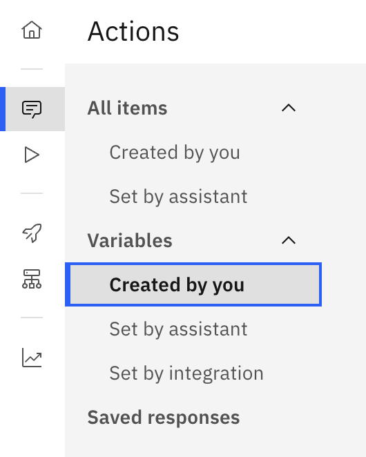
    </div>

#### Integração com o sistema da universidade

<div style="width:100px; height:100px">
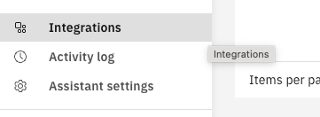
</div>

- Acessar o `endpoint` para obter a lista de disciplinas

    `https://sistema-universitario.glitch.me/grade/1000`

- Formato `OpenAPI`
```
Gere um json no formato OpenAPI para o endpoint https://sistema-universitario.glitch.me/grade/:matricula onde :matricula corresponde à matrícula do aluno. O endpoint retorna um JSON no formato {aluno: "nome do aulo", disciplinas: ["disciplina1", "disciplina2"]}
```

<div style="width:100px; height:100px">
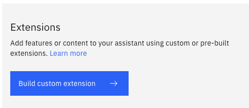
</div>

- Desenvolver um diálogo para que o aluno possa solicitar a nota de uma disciplina informando o número de matrícula e a descrição da disciplina

    `https://sistema-universitario.glitch.me/nota/1000/Estrutura de Dados`

- Desenvolver um diálogo para que o aluno possa consultar a sala de aula de uma disciplina

    `https://sistema-universitario.glitch.me/sala/Estrutura de Dados`

### Personalizando o chatbot
- Instalar em uma página HTML

    [Instalar Assistente](https://developer.ibm.com/tutorials/embed-watson-assistant-in-website/)

- Código inicial para exibir o chatbot em um site
    ```javascript
    <script>
      window.watsonAssistantChatOptions = {
        // A UUID like '1d7e34d5-3952-4b86-90eb-7c7232b9b540' included in the embed code provided in IBM watsonx Assistant.
        integrationID: 'YOUR_INTEGRATION_ID',
        // Your assistants region e.g. 'us-south', 'us-east', 'jp-tok' 'au-syd', 'eu-gb', 'eu-de', etc.
        region: 'YOUR_REGION',
        // A UUID like '6435434b-b3e1-4f70-8eff-7149d43d938b' included in the embed code provided in IBM watsonx Assistant.
        serviceInstanceID: 'YOUR_SERVICE_INSTANCE_ID',
        // The callback function that is called after the widget instance has been created.
        onLoad: async (instance) => {
          await instance.render();
        }
      };
      setTimeout(function(){const t=document.createElement('script');t.src='https://web-chat.global.assistant.watson.appdomain.cloud/versions/' + (window.watsonAssistantChatOptions.clientVersion || 'latest') + '/WatsonAssistantChatEntry.js';document.head.appendChild(t);});
    </script>
    ```
- Para obter um exemplo, clicar em
    <div style="width:100px; height:100px">
    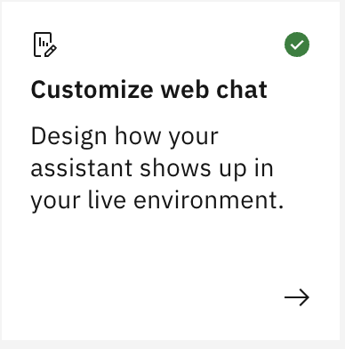
    </div>

- E em seguida, clicar na aba superior **Embed**
- `onLoad` executado quando o chatbot é carregado
- Configurações de *layout*
    ```json
        layout: {
            showFrame: true,
            hasContentMaxWidth: false,
        }
    ```
- Configurações do tema
    ```json
        themeConfig: {
            carbonTheme: 'g100',
            corners: 'round',
        }
    ```
- Obs: `carbonTheme` podem ser "white", "g10", "g90" ou "g100" e `corner` "square" ou "round"
- Botão para fechar o chatbot
    ```json
        headerConfig: {
            closeButtonIconType: 'side-panel-left',
        }
    ```
- Obs: opções "minimize", "close", "side-panel-left" e "side-panel-right".
#### Eventos
- Lista de eventos completa pode ser encontrada [Aqui](https://web-chat.global.assistant.watson.cloud.ibm.com/docs.html?to=api-events#event-list)
    ```javascript
        instance.on({
            type: 'receive', handler: (event) => { console.log('I received a message!', event); }
        });
    ```
- Evento `receive`: executado quando uma mensagem é recebida;
- - Os principais parâmetros recebidos pelas funçõs na varável `event` são:
    - `event.data`: mensagem (dados) recebidos pelo chatbot como respostas das intenções do usuário;
    - `event.data.output.generic`: itens da resposta recebidos (texto, etc...)
- Evento `pre:receive`: executado antes do `receive`;
    ```javascript
        instance.on({
            type: 'pre:receive', handler: (event) => {
                console.log('pre:receive')
                const message = event.data;
                if (message.output.generic) {
                    message.output.generic.forEach(messageItem => {
                        console.log(messageItem);
                        if (messageItem.response_type === 'text') {
                            messageItem.response_type = 'teste123';
                        }
                    })
                }
            }
        });
    ```

- Evento `customResponse`: permite criar uma resposta personalizada;
    ```javascript
        function customResponseHandler(event) {
            const { message, element, fullMessage } = event.data;

            const div = document.createElement('div');
            // obtem o texto da mensagem
            div.innerHTML = message.text;
            div.style.border = 'solid 1px';
            div.style.color = 'red';

            // message.options.forEach((messageItem, index) => {
            //     const button = document.createElement('button');
            //     button.innerHTML = messageItem.label;
            //     button.classList.add('CardButton');
            //     button.addEventListener('click', () => onClick(messageItem, button, fullMessage, index));
            //     element.appendChild(button);
            // });

            element.appendChild(div);

        }
    ```

## IoT

- Acessar o emulador [Arduino Uno](https://wokwi.com/projects/new/arduino-uno) ou [instalar no VSCode](https://docs.wokwi.com/pt-BR/vscode/getting-started)
- Instalar no **VS Code** as extensões (e reiniciar o VS Code) - [Referência](https://docs.platformio.org/en/latest/integration/ide/vscode.html#quick-start):
    - Wokwi
    <div style="width:200px">
    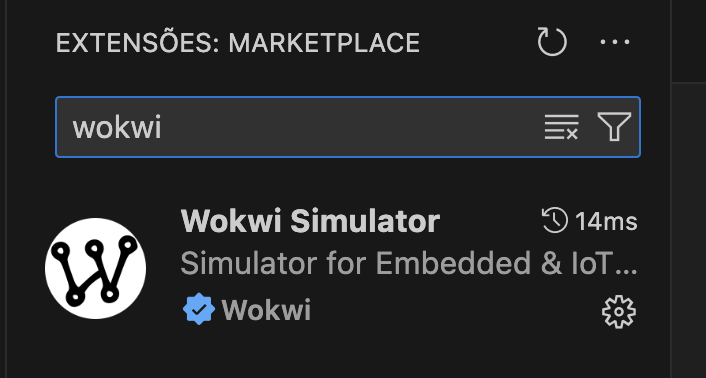
    </div>

    - PlatformIO IDE
    <div style="width:200px">
    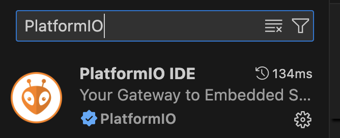
    </div>

    - Clicar no ícone **PlatformIO: Home** (ícone da casa) na barra de ícones na parte inferior da tela do **VS Code**
    <div style="width:200px">
    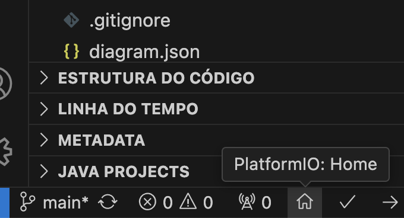
    </div>

    - Iniciar um novo projeto (desmarcar a opção **Location: use default location!!!!**) e selecionar uma pasta para criar o projeto
    <div style="width:350px">
    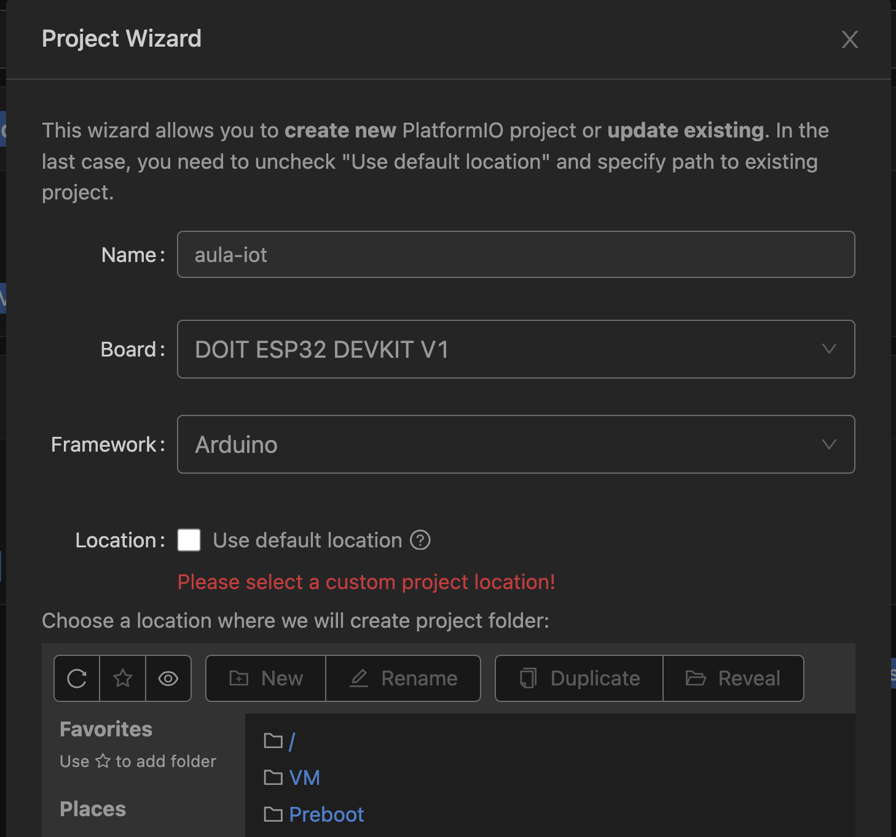
    </div>

    - Criar dois arquivos `diagram.json` e `wokwi.toml` dentro da estrutura do projeto
    <div style="width:200px">
    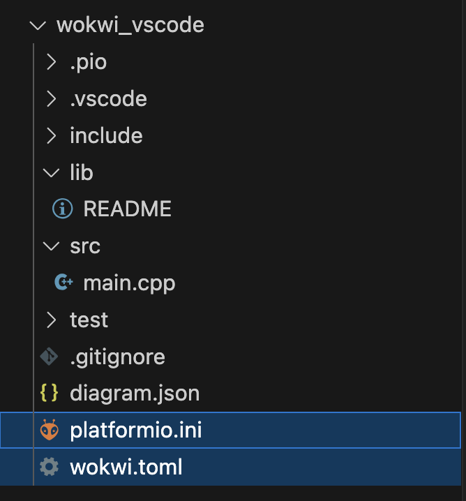
    </div>

    - Conteúdo dos arquivos (respectivamente `diagram.json` e `wokwi.toml`):
    ```json
    {
        "version": 1,
        "author": "Anonymous maker",
        "editor": "wokwi",
        "parts": [
            {
                "type": "board-esp32-devkit-c-v4",
                "id": "esp",
                "top": 0,
                "left": 0,
                "attrs": {}
            }
        ],
        "connections": [
            [
                "esp:TX",
                "$serialMonitor:RX",
                "",
                []
            ],
            [
                "esp:RX",
                "$serialMonitor:TX",
                "",
                []
            ]
        ],
        "dependencies": {}
    }
    ```
    ```javascript    
    [wokwi]
    version = 1
    firmware = '.pio/build/esp32doit-devkit-v1/firmware.bin'
    elf = '.pio/build/esp32doit-devkit-v1/firmware.elf'
    ```
    - Realizar o *build* da aplicação (pressionar `Control + Shift + P` ou `Command + Shift + P`)
    <div style="width:300px">
    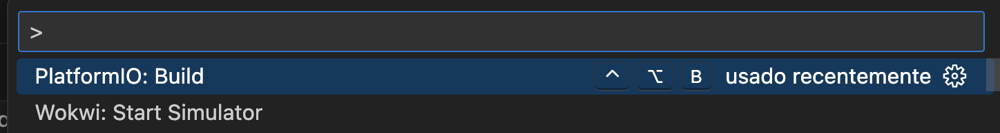
    </div>

    - Executar o emulador
    <div style="width:300px">
    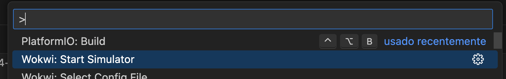
    </div>

    - Editar o código (pressionar `main.cpp`)
    <div style="width:200px">
    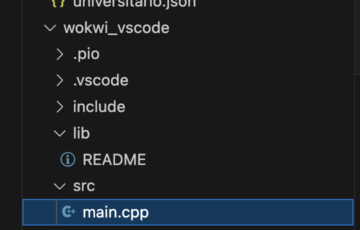
    </div>
#### Linguagem Arduino
- É uma linguagem para progeramação do **Arduino** [Linguagem Arduino](https://www.arduino.cc/reference/pt/)
- Código básico
    ```javascript
    void setup() {
      // Configurações iniciais
    }
    
    void loop() {
      // Loop principal
    }
    ```
- Principais funções:
    - `pinMode(pino, modo)`: configura um pino como entrada (`INPUT`) ou saída (`OUTPUT`)
    - `digitalWrite(pino, valor)`: envia um sinal (`HIGH` / `LOW`) a um determinado pino
    - `delay(ms)`: aguarda o período especificado (em milisegundos)
- Exemplo *led* piscando no pino 13:
    ```javascript
    // Defina o pino do LED
    const int ledPin = 13;
    
    void setup() {
      // Configure o pino do LED como saída
      pinMode(ledPin, OUTPUT);
    }
    
    void loop() {
      // Acenda o LED
      digitalWrite(ledPin, HIGH);
      // Espere 1 segundo (1000 milissegundos)
      delay(1000);
      // Apague o LED
      digitalWrite(ledPin, LOW);
      // Espere 1 segundo (1000 milissegundos)
      delay(1000);
    }
    ```
- Saída serial - permite comunicação com um computador via porta serial
- Imprimir caracteres ASCII
```javascript
    void setup() {
        // definir taxa de transmissão (bauds)
        Serial.begin(9600);
    }
    
    void loop() {
        // imprimir mensagem
        Serial.println("Arduino is ok");
        // Verifica se há dados disponíveis na porta serial
        if (Serial.available() > 0) {
            // Lê a string digitada pelo usuário
            String texto = Serial.readStringUntil('\n'); // Lê até o usuário pressionar Enter
            // Imprime o texto lido no monitor serial
            Serial.print("Você digitou: ");
            Serial.println(texto);
        }
    }
```

- Exemplo 3 leds piscando de forma aleatória
    ```javascript
    // Defina os pinos dos LEDs
    const int ledPins[] = {8, 9, 10}; // Pinos aos quais os LEDs estão conectados
    const int numLeds = 3; // Número de LEDs
    
    void setup() {
      // Configure todos os pinos dos LEDs como saída
      for (int i = 0; i < numLeds; i++) {
        pinMode(ledPins[i], OUTPUT);
      }
      
      // Inicialize os LEDs apagados
      for (int i = 0; i < numLeds; i++) {
        digitalWrite(ledPins[i], LOW);
      }
    }
    
    void loop() {
      // Escolha um LED aleatório para piscar
      int ledIndex = random(numLeds);
      
      // Acenda o LED escolhido
      digitalWrite(ledPins[ledIndex], HIGH);
      
      // Espere um intervalo aleatório entre 500 e 1500 milissegundos
      delay(random(500, 1501));
      
      // Apague o LED escolhido
      digitalWrite(ledPins[ledIndex], LOW);
      
      // Espere um intervalo aleatório entre 500 e 1500 milissegundos antes de piscar o próximo LED
      delay(random(500, 1501));
    }
    ```
- Exemplo [push button](https://docs.wokwi.com/pt-BR/parts/wokwi-pushbutton) 
    - btn1:2r - uno:7
    - btn1:1l - gnd
    ```javascript
    #define LED_PIN 9
    #define BUTTON_PIN 7
    
    void setup() {
      pinMode(LED_PIN, OUTPUT);
      pinMode(BUTTON_PIN, INPUT_PULLUP);
    }
    
    void loop() {
      int button_val = digitalRead(BUTTON_PIN);
      if (button_val == 0) {
        digitalWrite(LED_PIN, HIGH);
      } else {
        digitalWrite(LED_PIN, LOW);
      }
    }
    ```
- Exemplo [joystick](https://docs.wokwi.com/pt-BR/parts/wokwi-analog-joystick)
    - Utilizar portas seriais
        - joystick1:VERT - A0 (1023 - cima, 0 - baixo)
        - joystick1:HORIZ - A1 (1023 - direita, 0 - esquerda)
        - joystick1:SEL - uno:0 (porta digital - true para solto e false para pressionado)
        
    ```javascript
    #define LED_L_PIN 9
    #define LED_R_PIN 8
    
    #define VERT_PIN A0
    #define HORZ_PIN A1
    #define SEL_PIN  0
    
    void setup() {
      pinMode(LED_L_PIN, OUTPUT);
      pinMode(LED_R_PIN, OUTPUT);
      pinMode(VERT_PIN, INPUT);
      pinMode(HORZ_PIN, INPUT);
      pinMode(SEL_PIN, INPUT_PULLUP);
    }
    
    void loop() {
      int vert = analogRead(VERT_PIN);
      int horz = analogRead(HORZ_PIN);
      int sel = digitalRead(SEL_PIN);
    
      if (sel) {
        digitalWrite(LED_L_PIN, LOW);
        digitalWrite(LED_R_PIN, LOW); 
      } else {
        digitalWrite(LED_L_PIN, HIGH);
        digitalWrite(LED_R_PIN, HIGH);  
      }
    
      if (horz == 1023) {
        digitalWrite(LED_L_PIN, HIGH);
        digitalWrite(LED_R_PIN, LOW);
      } else  if (horz == 0){
        digitalWrite(LED_L_PIN, LOW);
        digitalWrite(LED_R_PIN, HIGH); 
      }
    
    }
    ```
- Exercício: Acender 4 leds conforme o movimento realizado pelo *joysctick*
- Exemplo [display de 7 segmentos](https://docs.wokwi.com/pt-BR/parts/wokwi-7segment)
    - P(2) - S(A), P(3) - S(B), P(4) - S(C), P(5) - S(D), P(6) - S(E), P(7) - S(F), P(8) - S(G)
    - COM2 - GND
    - Diagrama:
    ```json
    {
      "version": 1,
      "author": "Anonymous maker",
      "editor": "wokwi",
      "parts": [
        { "type": "wokwi-arduino-uno", "id": "uno", "top": 48.6, "left": 18.6, "attrs": {} },
        {
          "type": "wokwi-7segment",
          "id": "sevseg1",
          "top": -119.82,
          "left": 120.28,
          "attrs": { "common": "cathode", "color": "#00ff00", "digits": "1", "colon": "" }
        }
      ],
      "connections": [
        [ "sevseg1:A", "uno:2", "#8f4814", [ "v-18.36", "h105.6" ] ],
        [ "sevseg1:B", "uno:3", "red", [ "v-18.36", "h19.2", "v9.6", "h57.6" ] ],
        [ "sevseg1:C", "uno:4", "gold", [ "v9.6", "h76.8" ] ],
        [ "sevseg1:D", "uno:5", "green", [ "v19.2", "h86.4" ] ],
        [ "sevseg1:E", "uno:6", "blue", [ "v28.8", "h96" ] ],
        [ "sevseg1:F", "uno:7", "white", [ "v-18.36", "h-48", "v153.6", "h124.8" ] ],
        [ "sevseg1:G", "uno:8", "gray", [ "v0.84", "h-9.6", "v115.2", "h76.8" ] ],
        [ "sevseg1:COM.2", "uno:GND.1", "green", [ "h0", "v-37.56", "h-76.8", "v192", "h67.2" ] ]
      ],
      "dependencies": {}
    }
    ```
    
    ```javascript
    const int segmentPins[8] = {2, 3, 4, 5, 6, 7, 8};
    
    const byte numbers[11] = {
      B11111100, // 0
      B01100000, // 1
      B11011010, // 2
      B11110010, // 3
      B01100110, // 4
      B10110110, // 5
      B10111110, // 6
      B11100000, // 7
      B11111110, // 8
      B11110110  // 9
    };
    
    void setup() {
    
      for (int i = 0; i < 7; i++) {
        pinMode(segmentPins[i], OUTPUT);
      }
    
    }
    
    void loop() {
    
      for (int i = 0; i < 10; i++) 
      {
        displayNumber(i);
        delay(1000);
      }
    }
    
    
    void displayNumber(int num) {
    
      for (int i = 0; i < 8; i++) {
        digitalWrite(segmentPins[i], HIGH);
      }
    
    
      for (int i = 0; i < 8; i++) {
        if (bitRead(numbers[num], i) == LOW) {
          digitalWrite(segmentPins[7-i], LOW);
        }
      }
    
    }
    
    ```
- Gerar números aleatórios com a função [random](https://www.arduino.cc/reference/en/language/functions/random-numbers/random/)
- Uso de [bibliotecas Arduino](https://www.arduino.cc/reference/en/libraries/)
- Exemplo [motor](https://docs.wokwi.com/pt-BR/parts/wokwi-stepper-motor)
    - Definir no `diagram.json`:
    ```json
        {
      "version": 1,
      "author": "Michael Möller",
      "editor": "wokwi",
      "parts": [
        { "type": "wokwi-arduino-uno", "id": "uno", "top": 160.98, "left": -237.02, "attrs": {} },
        {
          "type": "wokwi-stepper-motor",
          "id": "sw1",
          "top": -139.49,
          "left": -191.12,
          "attrs": { "gearRatio": "2:1", "display": "steps", "arrow": "orange" }
        }
      ],
      "connections": [
        [ "sw1:B-", "uno:8", "green", [ "v0" ] ],
        [ "sw1:A-", "uno:11", "yellow", [ "v0" ] ],
        [ "sw1:B+", "uno:9", "red", [ "v0" ] ],
        [ "sw1:A+", "uno:10", "blue", [ "v0" ] ]
      ],
      "dependencies": {}
    }
    ```
- Utilizar biblioteca `Stepper` do Arduino para controlar o motor de passo
    ```javascript
    #include <Stepper.h>
    
    const int stepsPerRevolution = 200;  // change this to fit the number of steps per revolution
    // for your motor
    
    // initialize the stepper library on pins 8 through 11:
    Stepper myStepper(stepsPerRevolution, 8, 9, 10, 11);
    
    void setup() {
      // set the speed at 60 rpm:
      myStepper.setSpeed(60);
      // initialize the serial port:
      Serial.begin(9600);
    }
    
    void loop() {
      // step one revolution  in one direction:
      Serial.println("clockwise");
      myStepper.step(stepsPerRevolution);
      delay(500);
    
      // step one revolution in the other direction:
      Serial.println("counterclockwise");
      myStepper.step(-stepsPerRevolution);
      delay(500);
    }
    ```
- Exemplo [servo](https://docs.wokwi.com/pt-BR/parts/wokwi-servo)
    - Adicionar a biblioteca `Servo` no arquivo `libraries.txt`
    ```javascript
    #include <Servo.h>
    
    Servo arm; // Create a "Servo" object called "arm"
    float pos = 0.0; // Variable where the arm's position will be stored (in degrees)
    float step = 1.0; // Variable used for the arm's position step
    
    void setup() {
    
      arm.attach(2); // Attache the arm to the pin 2
      arm.write(pos); // Initialize the arm's position to 0 (leftmost)
    
    }
    
    void loop() {
    
      arm.write(pos);
      delay(100);
      pos++;
    
    }
    ```
- Incluir ium [potenciômetro](https://docs.wokwi.com/pt-BR/parts/wokwi-potentiometer) para aumentar ou diminuir o passo do `servo`
    - Conectado à porta analógica (A0)
    ```javascript
    #include <Servo.h>
    
    Servo arm; // Create a "Servo" object called "arm"
    float pos = 0.0; // Variable where the arm's position will be stored (in degrees)
    float step = 1.0; // Variable used for the arm's position step
    
    void setup() {
    
      arm.attach(2); // Attache the arm to the pin 2
      arm.write(pos); // Initialize the arm's position to 0 (leftmost)
    
      Serial.begin(115200);
      pinMode(A0, INPUT);
    
    }
    
    void loop() {
    
      arm.write(pos);
      delay(100);
      pos = pos + step;
    
      step = analogRead(A0);
      Serial.println(step);
    
    }
    ```

- Exemplo sensor de temperatura (DS 18B20 - pinos: alimentação, leitura e terra)
    - Ligar a leitura no pino 10
    ```javascript
    #include <OneWire.h>
    #include <DallasTemperature.h>
    
    OneWire oneWire(10);
    DallasTemperature sensor(&oneWire);
    
    void setup(void) {
        Serial.begin(115200);
        delay(2);
        sensor.begin();
        delay(20);
    }
    
    void loop(void) {
        sensor.requestTemperatures();
        Serial.print("Temperature is: ");
        delay(10);
        Serial.println(sensor.getTempCByIndex(0));
        delay(1000);
    }
    ```
#### Acesso Internet
- Arduino Uno não possui interface com a internet
- Utilizar o [ESP32](https://wokwi.com/projects/new/esp32) que possui uma placa de rede integrada
- Conexão com o WiFi
    ```javascript
    #include <WiFi.h>
    
    void setup() {
      Serial.begin(9600);
      Serial.print("Conectando-se ao Wi-Fi");
      // Wokwi simula uma rede WiFi com acesso total à Internet com o usuário Wokwi-GUEST
      // não precisa de senha
      WiFi.begin("Wokwi-GUEST", "", 6);
      while (WiFi.status() != WL_CONNECTED) {
        delay(100);
        Serial.print(".");
      }
      Serial.println(" Conectado!");
    }
    
    void loop() {

    }
    ```

- Exemplo de requisição *POST*
    - Uso da biblioteca `HttpClient`
    - Executar um *POST* no *endpoint* `https://teste-iot-server.glitch.me/temperatura`
    - No corpo da requisição, enviar `{"sensor":"ESP32", "temperatura": 30}`
    ```javascript
    #include <WiFi.h>
    #include <HTTPClient.h>
    
    #define TEMPLATE "{\"sensor\":\"ESP32\",\"temperatura\":%d}"

    void setup() {
      Serial.begin(9600);
      Serial.print("Conectando-se ao Wi-Fi");
      WiFi.begin("Wokwi-GUEST", "", 6);
      while (WiFi.status() != WL_CONNECTED) {
        delay(100);
        Serial.print(".");
      }
      Serial.println(" Conectado!");
      Serial.println(WiFi.localIP());
    }
    
    void loop() {
      // Realizar a requisição POST
      if (WiFi.status() == WL_CONNECTED) {
        HTTPClient http;
    
        // Defina o URL do servidor que receberá a requisição POST
        http.begin("https://teste-iot-server.glitch.me/temperatura"); // Substitua pela URL do servidor
    
        // Defina o tipo de conteúdo (JSON, neste caso)
        http.addHeader("Content-Type", "application/json");
    
        // Dados JSON que serão enviados
        int temp = random(10, 40);
        char postData[100];
        // Copia a temperatura para o %d definido no template (TEMPLATE)
        sprintf(postData, TEMPLATE, temp);
    
        // Realiza a requisição POST
        int httpResponseCode = http.POST(postData);
    
        // Verifica a resposta do servidor
        if (httpResponseCode > 0) {
          String response = http.getString();  // Obtém a resposta
          Serial.println("Resposta do servidor: " + response);
        } else {
          Serial.println("Erro na requisição POST");
        }
    
        http.end();  // Fecha a conexão
      } else {
        Serial.println("Falha na conexão Wi-Fi");
      }
    }
    ```
- Ajustar o exemplo acima para enviar dados do sensor de temperatura **DS 18B20**
- Obter o status de um *led* com base na requisição **GET** de um *endpoint* `https://teste-iot-server.glitch.me/led`
- Para ligar ou desligar, efetuar um **POST** na mesma URL com o corpo `{"status":"ligado"}`
- Criar um app em nodejs para alterar o status do *led*
***
#### MQTT
- Exemplo [Mosquitto Broker](https://mosquitto.org/) para *publish*
- Incluir a biblioteca [PubSubClient](https://pubsubclient.knolleary.net/api)
- No caso do **VS Code** a biblioteca deve ser incluída no arquivo `platformio.ini`
    ```javascript
    [env:esp32doit-devkit-v1]
    platform = espressif32
    board = esp32doit-devkit-v1
    framework = arduino
    lib_deps = PubSubClient
    ```
- Exemplo de código para publicar uma mensagem no **Mosquitto Broker**
    ```javascript
    #include <WiFi.h>
    #include <PubSubClient.h>
    
    // Substitua pelos detalhes da sua rede WiFi
    #define SSID "Wokwi-GUEST"
    #define WIFI_PASSWD ""
    // Substitua pelos detalhes do broker Mosquitto
    #define MQTT_SERVER "test.mosquitto.org"
    #define MQTT_PORT 1883 // Porta padrão MQTT para conexões não seguras
    
    WiFiClient espClient;
    PubSubClient client(espClient);
    
    void setup_wifi()
    {
      delay(10);
      Serial.println();
      Serial.print("Conectando-se a ");
      Serial.println(SSID);
    
      WiFi.begin(SSID, WIFI_PASSWD);
      while (WiFi.status() != WL_CONNECTED)
      {
        delay(500);
        Serial.print(".");
      }
    
      Serial.println("Conectado.");
      Serial.print("IP address: ");
      Serial.println(WiFi.localIP());
    }
    
    void connect_mqtt()
    {
      while (!client.connected())
      {
        Serial.print("Conectando ao MQTT...");
        if (client.connect("WokwiClient"))
        {
          Serial.println("Conectado.");
        }
        else
        {
          Serial.print("Falha, rc=");
          Serial.print(client.state());
          Serial.println(" Tentar novamente em 5 segundos.");
          delay(5000);
        }
      }
    }
    
    void publish_message()
    {
      String message = "Hello from ESP!";
      if (client.publish("test/topic-esensato", message.c_str()))
      {
        Serial.println("Mensagem publicada com sucesso.");
      }
      else
      {
        Serial.println("Falha ao publicar a mensagem.");
      }
    }
    
    void setup()
    {
      Serial.begin(115200);
      setup_wifi();
      client.setServer(MQTT_SERVER, MQTT_PORT);
      connect_mqtt();
    }
    
    void loop()
    {
      if (!client.connected())
      {
        connect_mqtt();
      }
      client.loop();
      publish_message();
      delay(5000); // Aguarda 5 segundos entre publicações
    }
    ```
- Exemplo de um cliente MQTT em nodejs
    - Instalar a biblioteca `npm install mqtt --save`    

    ```javascript
    const mqtt = require("mqtt");
    const client = mqtt.connect("mqtt://test.mosquitto.org");
    
    client.on("connect", () => {
        client.subscribe("test/topic-esensato", (err) => {
            if (err) {
                console.log("Erro: ", err);
            } else {
                console.log("Inscrito")
            }
        });
    });
    
    client.on("message", (topic, message) => {
        console.log(message.toString());
        client.end();
    });
    ```
- Exemplo *subscribe*

    ```javascript
    #include <WiFi.h>
    #include <PubSubClient.h>
    
    // Substitua pelos detalhes da sua rede WiFi
    const char* ssid = "Wokwi-GUEST";
    const char* password = "";
    
    // Substitua pelos detalhes do broker Mosquitto
    const char* mqtt_server = "test.mosquitto.org";
    const int mqtt_port = 1883; // Porta padrão MQTT para conexões não seguras
    
    WiFiClient espClient;
    PubSubClient client(espClient);
    
    void setup_wifi() {
      delay(10);
      Serial.println();
      Serial.print("Conectando-se a ");
      Serial.println(ssid);
      
      WiFi.begin(ssid, password);
      while (WiFi.status() != WL_CONNECTED) {
        delay(500);
        Serial.print(".");
      }
      
      Serial.println("Conectado.");
      Serial.print("IP address: ");
      Serial.println(WiFi.localIP());
    }
    
    void connect_mqtt() {
      while (!client.connected()) {
        Serial.print("Conectando ao MQTT...");
        if (client.connect("WokwiClient")) {
          Serial.println("Conectado.");
        } else {
          Serial.print("Falha, rc=");
          Serial.print(client.state());
          Serial.println(" Tentar novamente em 5 segundos.");
          delay(5000);
        }
      }
    }
    
    void publish_message() {
      String message = "Hello from ESP!";
      if (client.publish("test/topic-esensato", message.c_str())) {
        Serial.println("Mensagem publicada com sucesso.");
      } else {
        Serial.println("Falha ao publicar a mensagem.");
      }
    }

    void callback(char* topic, byte* payload, unsigned int length) {
      Serial.print("Mensagem recebida no tópico ");
      Serial.print(topic);
      Serial.print(": ");
      for (int i = 0; i < length; i++) {
        Serial.print((char)payload[i]);
      }
      Serial.println();
    }

    void setup() {
      Serial.begin(115200);
      setup_wifi();
      client.setServer(mqtt_server, mqtt_port);
      client.setCallback(callback);
      client.subscribe("test/topic-esensato");
      connect_mqtt();
    }
    
    void loop() {
      if (!client.connected()) {
        connect_mqtt();
      }
      client.loop();
    }
    ```
- Exemplo *publish* em *nodejs*
    ```javascript
    const mqtt = require("mqtt");
    const client = mqtt.connect("mqtt://test.mosquitto.org");
    
    client.on("connect", () => {
    
        client.publish("test/topic-esensato", "Teste 123");
    
    });
    ```
- Outro broker conhecido é o [HiveMQ](https://www.hivemq.com)
    - [Broker público](https://www.hivemq.com/mqtt/public-mqtt-broker/)
    - [Broker Cloud](https://www.hivemq.com/company/get-hivemq/)
    - [Websocket Client](https://www.hivemq.com/demos/websocket-client/)
    - [Hivemq certificado](https://letsencrypt.org/certs/isrgrootx1.pem)
- Criar cluster e obter dados de acesso:  
    <div style="width:500px; height:300px">
    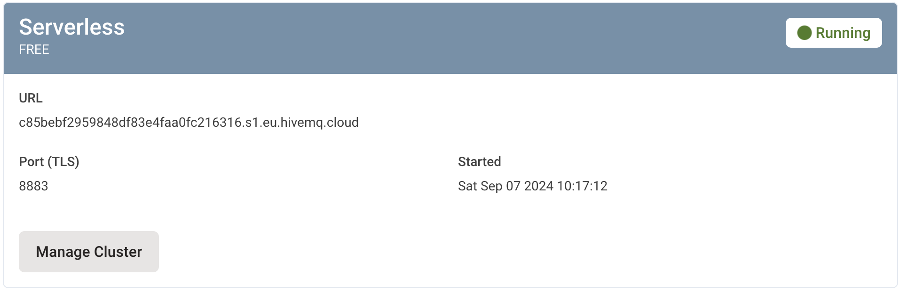
    </div>
- Trabalhando com *buffers* utilizando o `snprintf` (`%s` é *string*, `%d` para decimal)
    ```javascript
    Serial.begin(115200);
    delay(100);
    char msg[100];
    snprintf(msg, 100, "Valor %s", "Teste");
    Serial.println(msg);
    ```
- Publicar uma mensagem em um tópico:
    ```javascript
    #include <WiFi.h>
    #include <PubSubClient.h>
    #include <WiFiClientSecure.h>
    
    //---- WiFi settings
    const char *ssid = "Wokwi-GUEST";
    const char *password = "";
    
    //---- HiveMQ Cloud Broker settings
    const char *mqtt_server = ""; // replace with your HiveMQ Cluster URL
    const char *mqtt_username = "";                                             // replace with your Username
    const char *mqtt_password = "";                                         // replace with your Password
    const int mqtt_port = 8883;
    
    WiFiClientSecure espClient;
    PubSubClient client(espClient);
    unsigned long lastMsg = 0;
    #define MSG_BUFFER_SIZE (500)
    char msg[MSG_BUFFER_SIZE];
    
    // HiveMQ Cloud Let's Encrypt CA certificate
    static const char *root_ca PROGMEM = R"EOF(
    -----BEGIN CERTIFICATE-----
    MIIFazCCA1OgAwIBAgIRAIIQz7DSQONZRGPgu2OCiwAwDQYJKoZIhvcNAQELBQAw
    TzELMAkGA1UEBhMCVVMxKTAnBgNVBAoTIEludGVybmV0IFNlY3VyaXR5IFJlc2Vh
    cmNoIEdyb3VwMRUwEwYDVQQDEwxJU1JHIFJvb3QgWDEwHhcNMTUwNjA0MTEwNDM4
    WhcNMzUwNjA0MTEwNDM4WjBPMQswCQYDVQQGEwJVUzEpMCcGA1UEChMgSW50ZXJu
    ZXQgU2VjdXJpdHkgUmVzZWFyY2ggR3JvdXAxFTATBgNVBAMTDElTUkcgUm9vdCBY
    MTCCAiIwDQYJKoZIhvcNAQEBBQADggIPADCCAgoCggIBAK3oJHP0FDfzm54rVygc
    h77ct984kIxuPOZXoHj3dcKi/vVqbvYATyjb3miGbESTtrFj/RQSa78f0uoxmyF+
    0TM8ukj13Xnfs7j/EvEhmkvBioZxaUpmZmyPfjxwv60pIgbz5MDmgK7iS4+3mX6U
    A5/TR5d8mUgjU+g4rk8Kb4Mu0UlXjIB0ttov0DiNewNwIRt18jA8+o+u3dpjq+sW
    T8KOEUt+zwvo/7V3LvSye0rgTBIlDHCNAymg4VMk7BPZ7hm/ELNKjD+Jo2FR3qyH
    B5T0Y3HsLuJvW5iB4YlcNHlsdu87kGJ55tukmi8mxdAQ4Q7e2RCOFvu396j3x+UC
    B5iPNgiV5+I3lg02dZ77DnKxHZu8A/lJBdiB3QW0KtZB6awBdpUKD9jf1b0SHzUv
    KBds0pjBqAlkd25HN7rOrFleaJ1/ctaJxQZBKT5ZPt0m9STJEadao0xAH0ahmbWn
    OlFuhjuefXKnEgV4We0+UXgVCwOPjdAvBbI+e0ocS3MFEvzG6uBQE3xDk3SzynTn
    jh8BCNAw1FtxNrQHusEwMFxIt4I7mKZ9YIqioymCzLq9gwQbooMDQaHWBfEbwrbw
    qHyGO0aoSCqI3Haadr8faqU9GY/rOPNk3sgrDQoo//fb4hVC1CLQJ13hef4Y53CI
    rU7m2Ys6xt0nUW7/vGT1M0NPAgMBAAGjQjBAMA4GA1UdDwEB/wQEAwIBBjAPBgNV
    HRMBAf8EBTADAQH/MB0GA1UdDgQWBBR5tFnme7bl5AFzgAiIyBpY9umbbjANBgkq
    hkiG9w0BAQsFAAOCAgEAVR9YqbyyqFDQDLHYGmkgJykIrGF1XIpu+ILlaS/V9lZL
    ubhzEFnTIZd+50xx+7LSYK05qAvqFyFWhfFQDlnrzuBZ6brJFe+GnY+EgPbk6ZGQ
    3BebYhtF8GaV0nxvwuo77x/Py9auJ/GpsMiu/X1+mvoiBOv/2X/qkSsisRcOj/KK
    NFtY2PwByVS5uCbMiogziUwthDyC3+6WVwW6LLv3xLfHTjuCvjHIInNzktHCgKQ5
    ORAzI4JMPJ+GslWYHb4phowim57iaztXOoJwTdwJx4nLCgdNbOhdjsnvzqvHu7Ur
    TkXWStAmzOVyyghqpZXjFaH3pO3JLF+l+/+sKAIuvtd7u+Nxe5AW0wdeRlN8NwdC
    jNPElpzVmbUq4JUagEiuTDkHzsxHpFKVK7q4+63SM1N95R1NbdWhscdCb+ZAJzVc
    oyi3B43njTOQ5yOf+1CceWxG1bQVs5ZufpsMljq4Ui0/1lvh+wjChP4kqKOJ2qxq
    4RgqsahDYVvTH9w7jXbyLeiNdd8XM2w9U/t7y0Ff/9yi0GE44Za4rF2LN9d11TPA
    mRGunUHBcnWEvgJBQl9nJEiU0Zsnvgc/ubhPgXRR4Xq37Z0j4r7g1SgEEzwxA57d
    emyPxgcYxn/eR44/KJ4EBs+lVDR3veyJm+kXQ99b21/+jh5Xos1AnX5iItreGCc=
    -----END CERTIFICATE-----
    )EOF";
    
    void setup_wifi()
    {
      delay(10);
      // We start by connecting to a WiFi network
      Serial.println();
      Serial.print("Connecting to ");
      Serial.println(ssid);
    
      WiFi.mode(WIFI_STA);
      WiFi.begin(ssid, password);
    
      while (WiFi.status() != WL_CONNECTED)
      {
        delay(500);
        Serial.print(".");
      }
    
      randomSeed(micros());
    
      Serial.println("");
      Serial.println("WiFi connected");
      Serial.println("IP address: ");
      Serial.println(WiFi.localIP());
    }
    
    void reconnect()
    {
      // Loop until we’re reconnected
      while (!client.connected())
      {
        Serial.print("Attempting MQTT connection… ");
        String clientId = "ESP32Client";
        // Attempt to connect
        if (client.connect(clientId.c_str(), mqtt_username, mqtt_password))
        {
          Serial.println("connected!");
        }
        else
        {
          Serial.print("failed, rc = ");
          Serial.print(client.state());
          Serial.println(" try again in 5 seconds");
          // Wait 5 seconds before retrying
          delay(5000);
        }
      }
    }
    
    void setup()
    {
      delay(500);
      // When opening the Serial Monitor, select 9600 Baud
      Serial.begin(115200);
      delay(500);
    
      setup_wifi();
    
      espClient.setCACert(root_ca);
      client.setServer(mqtt_server, mqtt_port);
    }
    
    void loop()
    {
      if (!client.connected())
      {
        reconnect();
      }
    
      // Construct your message with the formatted value
      snprintf(msg, MSG_BUFFER_SIZE, "%s", "TESTE");
      Serial.print("Publish message: ");
      Serial.println(msg);
      // Publish the message to the topic
      client.publish("esp32/teste", msg);
      delay(10000);
    }
    ```
- Exemplo com *publish* e *subscribe*  

      ```javascript
      #include <WiFi.h>  
      #include <PubSubClient.h>
      // Não precisa incluir na biblioteca (libraries.txt)!!!
      #include <WiFiClientSecure.h>
      
      #define MSG_BUFFER_SIZE (500)

      const char* ssid = "Wokwi-GUEST";
      const char* password = "";
        
      const char* mqtt_server = ""; // obter dos dados de acesso do cluster HiveMQ
      const char* mqtt_username = ""; // usuário criado para o cluster HiveMQ
      const char* mqtt_password = ""; // senha criada para o cluster HiveMQ
      const int mqtt_port = 8883;
      
      WiFiClientSecure espClient;  
      PubSubClient client(espClient);
      unsigned long lastMsg = 0;

      char msg[MSG_BUFFER_SIZE];
      int value = 0;
      
      // Variables to store received values
      bool ledValue = false;
      int brilhoValue = 0;
      int nivelAguaValue = 0;
      int umidadeSoloValue = 0;
      
      // Obter o certificado do link especificado no link acima
      static const char *root_ca PROGMEM = R"EOF(
      -----BEGIN CERTIFICATE-----
      MIIFazCCA1OgAwIBAgIRAIIQz7DSQONZRGPgu2OCiwAwDQYJKoZIhvcNAQELBQAw
      TzELMAkGA1UEBhMCVVMxKTAnBgNVBAoTIEludGVybmV0IFNlY3VyaXR5IFJlc2Vh
      cmNoIEdyb3VwMRUwEwYDVQQDEwxJU1JHIFJvb3QgWDEwHhcNMTUwNjA0MTEwNDM4
      WhcNMzUwNjA0MTEwNDM4WjBPMQswCQYDVQQGEwJVUzEpMCcGA1UEChMgSW50ZXJu
      ZXQgU2VjdXJpdHkgUmVzZWFyY2ggR3JvdXAxFTATBgNVBAMTDElTUkcgUm9vdCBY
      MTCCAiIwDQYJKoZIhvcNAQEBBQADggIPADCCAgoCggIBAK3oJHP0FDfzm54rVygc
      h77ct984kIxuPOZXoHj3dcKi/vVqbvYATyjb3miGbESTtrFj/RQSa78f0uoxmyF+
      0TM8ukj13Xnfs7j/EvEhmkvBioZxaUpmZmyPfjxwv60pIgbz5MDmgK7iS4+3mX6U
      A5/TR5d8mUgjU+g4rk8Kb4Mu0UlXjIB0ttov0DiNewNwIRt18jA8+o+u3dpjq+sW
      T8KOEUt+zwvo/7V3LvSye0rgTBIlDHCNAymg4VMk7BPZ7hm/ELNKjD+Jo2FR3qyH
      B5T0Y3HsLuJvW5iB4YlcNHlsdu87kGJ55tukmi8mxdAQ4Q7e2RCOFvu396j3x+UC
      B5iPNgiV5+I3lg02dZ77DnKxHZu8A/lJBdiB3QW0KtZB6awBdpUKD9jf1b0SHzUv
      KBds0pjBqAlkd25HN7rOrFleaJ1/ctaJxQZBKT5ZPt0m9STJEadao0xAH0ahmbWn
      OlFuhjuefXKnEgV4We0+UXgVCwOPjdAvBbI+e0ocS3MFEvzG6uBQE3xDk3SzynTn
      jh8BCNAw1FtxNrQHusEwMFxIt4I7mKZ9YIqioymCzLq9gwQbooMDQaHWBfEbwrbw
      qHyGO0aoSCqI3Haadr8faqU9GY/rOPNk3sgrDQoo//fb4hVC1CLQJ13hef4Y53CI
      rU7m2Ys6xt0nUW7/vGT1M0NPAgMBAAGjQjBAMA4GA1UdDwEB/wQEAwIBBjAPBgNV
      HRMBAf8EBTADAQH/MB0GA1UdDgQWBBR5tFnme7bl5AFzgAiIyBpY9umbbjANBgkq
      hkiG9w0BAQsFAAOCAgEAVR9YqbyyqFDQDLHYGmkgJykIrGF1XIpu+ILlaS/V9lZL
      ubhzEFnTIZd+50xx+7LSYK05qAvqFyFWhfFQDlnrzuBZ6brJFe+GnY+EgPbk6ZGQ
      3BebYhtF8GaV0nxvwuo77x/Py9auJ/GpsMiu/X1+mvoiBOv/2X/qkSsisRcOj/KK
      NFtY2PwByVS5uCbMiogziUwthDyC3+6WVwW6LLv3xLfHTjuCvjHIInNzktHCgKQ5
      ORAzI4JMPJ+GslWYHb4phowim57iaztXOoJwTdwJx4nLCgdNbOhdjsnvzqvHu7Ur
      TkXWStAmzOVyyghqpZXjFaH3pO3JLF+l+/+sKAIuvtd7u+Nxe5AW0wdeRlN8NwdC
      jNPElpzVmbUq4JUagEiuTDkHzsxHpFKVK7q4+63SM1N95R1NbdWhscdCb+ZAJzVc
      oyi3B43njTOQ5yOf+1CceWxG1bQVs5ZufpsMljq4Ui0/1lvh+wjChP4kqKOJ2qxq
      4RgqsahDYVvTH9w7jXbyLeiNdd8XM2w9U/t7y0Ff/9yi0GE44Za4rF2LN9d11TPA
      mRGunUHBcnWEvgJBQl9nJEiU0Zsnvgc/ubhPgXRR4Xq37Z0j4r7g1SgEEzwxA57d
      emyPxgcYxn/eR44/KJ4EBs+lVDR3veyJm+kXQ99b21/+jh5Xos1AnX5iItreGCc=
      -----END CERTIFICATE-----
      )EOF";
      
      void setup_wifi() {
        delay(10);
        // We start by connecting to a WiFi network
        Serial.println();
        Serial.print("Connecting to ");
        Serial.println(ssid);
      
        WiFi.mode(WIFI_STA);
        WiFi.begin(ssid, password);
      
        while (WiFi.status() != WL_CONNECTED) {
          delay(500);
          Serial.print(".");
        }
      
        randomSeed(micros());
      
        Serial.println("");
        Serial.println("WiFi connected");
        Serial.println("IP address: ");
        Serial.println(WiFi.localIP());
      }
      
      void callback(char* topic, byte* payload, unsigned int length) {
        Serial.print("Message arrived [");
        Serial.print(topic);
        Serial.print("] ");
        
        // Convert payload to string
        String payloadStr;
        for (int i = 0; i < length; i++) {
          payloadStr += (char)payload[i];
        }
        
        // Store values based on topic
        if (strcmp(topic, "home/alecrim/led") == 0) {
          if (payloadStr == "true") {
            ledValue = true;
          } else {
            ledValue = false;
          }
        } else if (strcmp(topic, "home/alecrim/brilho") == 0) {
          brilhoValue = payloadStr.toInt();
        }
        
        Serial.println(payloadStr);
      }
      
      void reconnect() {
        // Loop until we’re reconnected
        while (!client.connected()) {
          Serial.print("Attempting MQTT connection… ");
          String clientId = "ESP32Client";
          // Attempt to connect
          if (client.connect(clientId.c_str(), mqtt_username, mqtt_password)) {
            Serial.println("connected!");
            // client.publish("testTopic", "Hello World!");
            // … and resubscribe
            client.subscribe("home/alecrim/led");
            client.subscribe("home/alecrim/brilho");
            client.subscribe("home/alecrim/nivel_agua");
            client.subscribe("home/alecrim/umidade_solo");
          } else {
            Serial.print("failed, rc = ");
            Serial.print(client.state());
            Serial.println(" try again in 5 seconds");
            // Wait 5 seconds before retrying
            delay(5000);
          }
        }
      }
      
      void setup() {
        delay(500);
        // When opening the Serial Monitor, select 9600 Baud
        Serial.begin(115200);
        delay(500);
      
        setup_wifi();
      
        espClient.setCACert(root_ca);
        client.setServer(mqtt_server, mqtt_port);
        client.setCallback(callback);
      }
      
      void loop() {
        if (!client.connected()) {
          reconnect();
        }
        
        client.loop();
      
        unsigned long now = millis();
        if (now - lastMsg > 5000) {
          lastMsg = now;
          ++value;
          
          // Convert integer value to char array
          char valueStr[10]; // Adjust size based on your integer range
          snprintf(valueStr, sizeof(valueStr), "%d", value);
          
          // Construct your message with the formatted value
          snprintf(msg, MSG_BUFFER_SIZE, "%s", valueStr);
            Serial.print("Publish message: ");
            Serial.println(msg);
            // Publish the message to the topic
            client.publish("home/alecrim/nivel_agua", msg);
            
            // Publish other values
            client.publish("home/alecrim/led", ledValue ? "true" : "false");
            
            char brilhoStr[10];
            snprintf(brilhoStr, sizeof(brilhoStr), "%d", brilhoValue);
            client.publish("home/alecrim/brilho", brilhoStr);
            
            char umidadeSoloStr[10];
            snprintf(umidadeSoloStr, sizeof(umidadeSoloStr), "%d", umidadeSoloValue);
            client.publish("home/alecrim/umidade_solo", umidadeSoloStr);
          }
        }
        ```
#### Think Speak
- A plataforma [Think Speak](https://thingspeak.com/) possui um mecanismo analítico para analisar os dados coletados pelos sensores
- Efetuar o cadastro na plataforma
- Criar um canal
    ```javascript
    #include <WiFi.h>
    #include <OneWire.h>
    #include <DallasTemperature.h>
    
    #define SENSOR_PIN 0
    
    OneWire oneWire(SENSOR_PIN);
    DallasTemperature sensor(&oneWire);
    
    // Network information
    char* ssid = "Wokwi-GUEST";
    const char* password = "";
    
    // ThingSpeak settings
    char server[] = "api.thingspeak.com";
    String writeAPIKey = "45BQ8GHUMYG19C9B";
    
    
    void setup(){
      
        Serial.begin(115200);
        delay(2);
        sensor.begin();
        delay(20);
        connectWiFi();
        
    }
    
    void loop(){
    
      sensor.requestTemperatures();
      delay(10);
      float temperatura = sensor.getTempCByIndex(0);
      delay(3000);
      httpRequest(temperatura);
      Serial.print(temperatura);
    
    }
    
    void connectWiFi(){
    
        while (WiFi.status() != WL_CONNECTED){
            WiFi.begin(ssid, password);
            delay(3000);
        }
        Serial.println("Connected");
    
    }
    
    void httpRequest(float field1Data) {
    
        WiFiClient client;
        
        if (!client.connect(server, 80)){
          
            Serial.println("Connection failed");
            client.stop();
            return;     
        }
        
        else{
            
            // Create data string to send to ThingSpeak.
            String data = "field1=" + String(field1Data); //shows how to include additional field data in http post
            
            // POST data to ThingSpeak.
            if (client.connect(server, 80)) {
              
                client.println("POST /update HTTP/1.1");
                client.println("Host: api.thingspeak.com");
                client.println("Connection: close");
                client.println("User-Agent: ESP32WiFi/1.1");
                client.println("X-THINGSPEAKAPIKEY: "+writeAPIKey);
                client.println("Content-Type: application/x-www-form-urlencoded");
                client.print("Content-Length: ");
                client.print(data.length());
                client.print("\n\n");
                client.print(data);
                
                Serial.println("Request efetuado");
                delay(250);
            }
        }
        client.stop();
    }
    ```        
***
## Realidade Mista
- Instalar (iOS) o **XR Viewr** (Android não precisa!)
- Abrir site `threejs.org` e buscar pelo exemplo (abrir em nova tab) `ar - cones`
- Para instalar no *desktop* via **Chrome** 
    - Pesquisar no **Google** por `webxr emulator chrome extension`
    - Habilitar via **Ferramentas do Desenvolvedor** (selecionar **Samsumg Galaxy S8+ (AR)**)
    - Atualizar a página
- Criar um projeto no [glitch](https://glitch.com/edit/#!/remix/glitch-hello-website)
    - Projeto [já existente](https://glitch.com/embed/#!/esensato-webxr)
- Preparação para o projeto:
- Arquivo `style.css`
    ```css
    body {
    	margin: 0;
    	background-color: #000000;
    	color: #ffffff;
    	font-family: Monospace;
    	font-size: 16px;
    	line-height: 24px;
    	overscroll-behavior: none;
    }
    
    canvas {
    	display: block;
    }
    ```
- Arquivo `index.html`
    ```html
    <!DOCTYPE html>
    <html lang="en">
      <head>
    
        <meta charset="utf-8" />
        <meta name="viewport" content="width=device-width, initial-scale=1" />
    
        <title>WebXR</title>
    
        <link rel="stylesheet" href="/style.css" />
    
        <script type="importmap">
          {
            "imports": {
              "three": "https://cdn.jsdelivr.net/npm/three@v0.149.0/build/three.module.js",
              "three/addons/": "https://cdn.jsdelivr.net/npm/three@v0.149.0/examples/jsm/"
            }
          }
        </script>
        
      </head>
      <body>
        
        <script type="module">
          import * as THREE from 'three';
    
          const container = document.createElement('div');
    			document.body.appendChild(container);
    
        </script>
    
      </body>
    </html>
    ```
- **Scene**: container básico para os elementos gráficos
    ```javascript
    let scene = new THREE.Scene();
    ```
- [Camera](https://threejs.org/docs/#api/en/cameras/PerspectiveCamera): ponto de vista do observador
    ```javascript
    let camera = new THREE.PerspectiveCamera(70, window.innerWidth / window.innerHeight, 0.01, 40);
    scene.add(camera)
    ```
- [Renderer](https://threejs.org/docs/#api/en/renderers/WebGLRenderer): exibe a cena utilizando *WebGL* como base
    ```javascript
    let renderer = new THREE.WebGLRenderer({ antialias: true, alpha: true });
    renderer.setPixelRatio(window.devicePixelRatio);
    renderer.setSize(window.innerWidth, window.innerHeight);

    container.appendChild(renderer.domElement);
    ```
- [Light](https://threejs.org/docs/#api/en/lights/HemisphereLight): fonte de luz posicionada acima da cena
    ```javascript
    var light = new THREE.HemisphereLight(0xffffff, 0xbbbbff, 1);
    light.position.set(0.5, 1, 0.25);
    scene.add(light);
    ```
- [Geometry](https://threejs.org/docs/#api/en/geometries/IcosahedronGeometry): forma geométrica
    - Outras formas podem ser consutadas [aqui](https://github.com/mrdoob/three.js/tree/master/src/geometries)
    ```javascript    
    const geometry = new THREE.IcosahedronGeometry(0.2, 1);
    ```
- [Material](https://threejs.org/docs/#api/en/materials/MeshPhongMaterial): tipo de material utilizado na superfície
    ```javascript
    const material = new THREE.MeshPhongMaterial({
      color      :  new THREE.Color("rgb(226,35,213)"),
      shininess  :  6,
      transparent: 1,
      opacity    : 0.8
    });
    ```
- [Mesh](https://threejs.org/docs/#api/en/objects/Mesh): representa figuras compostas de poígonos triangulares (juntando *geometry* e *material*)
    ```javascript
    let mesh = new THREE.Mesh(geometry, material);
    mesh.position.set(0, 0, -0.5);
    scene.add(mesh);
    
    renderer.setAnimationLoop(() => {
      renderer.render(scene, camera);
    });
    ```
- Finalmente, criar o *loop* principal da animação
    ```javascript
    renderer.setAnimationLoop(() => {
      renderer.render(scene, camera);
    });
    ```
- [BoxGeometry](https://threejs.org/docs/#api/en/geometries/BoxGeometry)
    ```javascript
    const boxGeom = new THREE.BoxGeometry(0.3, 0.3, 0.3);
    const boxMaterial = new THREE.MeshBasicMaterial({color: 0xe0676767});
    const boxMesh = new THREE.Mesh(boxGeom, boxMaterial);
    scene.add(boxMesh);
    boxMesh.position.z = -1;
    boxMesh.position.y = 0.5;
    ```
- [Torus](https://threejs.org/docs/index.html#api/en/geometries/TorusGeometry)
    ```javascript
    const torusGeom = new THREE.TorusGeometry( 0.15, 0.05, 12, 50 ); 
    const torusMaterial = new THREE.MeshBasicMaterial( { color: 0xffff00 } ); 
    const torusMesh = new THREE.Mesh( torusGeom, torusMaterial ); 
    torusMesh.position.set(0.0, 0.0, -1);
    scene.add(torusMesh);
    ```
- Posicionamento (x,y,z): x esquerda / direita, y cima / baixo e z profundidade (distância da câmera)
- [Cone](https://threejs.org/docs/index.html#api/en/geometries/ConeGeometry)
  ```javascript
  const coneGeom = new THREE.ConeGeometry( 0.2, 0.3, 32 ); 
  const coneMaterial = new THREE.MeshBasicMaterial( {color: 0xffff00} );
  const coneMesh = new THREE.Mesh(coneGeom, coneMaterial ); 
  coneMesh.position.set(0.0, 0.3, -1);
  scene.add( coneMesh );
  ```
- [Texto](https://threejs.org/docs/index.html#examples/en/geometries/TextGeometry)
    - Importar o `FontLoader`
    - Alguns exemplos de fontes podem ser obtidos [aqui](https://cdn.jsdelivr.net/npm/three@0.149.0/examples/fonts/)
    ```javascript
    import { FontLoader } from 'three/addons/loaders/FontLoader.js';
    import { TextGeometry } from 'three/addons/geometries/TextGeometry.js';
    
    const loader = new FontLoader();
    loader.load( 'https://cdn.jsdelivr.net/npm/three@0.149.0/examples/fonts/optimer_bold.typeface.json', function ( font ) {
        let textGeom = new TextGeometry( "WebXR", {
          font: font,
          size: 10,
          depth: 20,
          hover: 30,
          curveSegments: 12,
          bevelEnabled: true,
          bevelThickness: 10,
          bevelSize: 8,
          bevelOffset: 0,
          bevelSegments: 5
    } );
      
    const textMaterial = new THREE.MeshBasicMaterial( {color: 0xffff00} );
    const textMesh = new THREE.Mesh(textGeom, textMaterial ); 
    textMesh.position.set(0, 0.0, -100.0);
    scene.add( textMesh );

    } );
    ```
- Convertendo para **AR / WebXR**
    - Importar o *ARButton*
    ```javascript
    import { ARButton } from 'three/addons/webxr/ARButton.js';
    ```
    - Habilitar o *xr* eaAdicionar o botão
    ```javascript
    renderer.xr.enabled = true;
    const button = ARButton.createButton(renderer);
    document.body.appendChild(button);
    ```
- Modelagem **3D**
    - Modelos prontos do (Khronos Group)[https://github.com/KhronosGroup/glTF-Sample-Assets/tree/main/Models]
    - Tipos de loades para modelos 3D podem ser obtidos (aqui)[https://cdn.jsdelivr.net/npm/three@0.149.0/examples/jsm/loaders/]
    - 
    - Importar o *GLTFLoader*
    ```javascript
      import { GLTFLoader } from 'three/addons/loaders/GLTFLoader.js';
```javascript
      const gltfLoader = new GLTFLoader();
            gltfLoader.load( 'https://raw.githubusercontent.com/KhronosGroup/glTF-Sample-Assets/refs/heads/main/Models/Duck/glTF-Embedded/Duck.gltf', 
                        function ( gltf ) {
                gltf.scene.position.x = 0.0;
                gltf.scene.position.y = 0.0;
                gltf.scene.position.z = -3.0;
                  scene.add(gltf.scene);
            },
                        function (progress){
                                      console.log('Carregando modelo...');

            },
                        function (err){
                        console.log('Erro', err);
            } );
```
- Definir o modelo com o (sketchup)[https://app.sketchup.com/app]
- Salvar modelo como

https://www.khronos.org/gltf/

https://github.com/immersive-web/webxr-samples/tree/main/media/gltf

- Animações podem ser adicionadas sobre os modelos
    ```javascript
    renderer.setAnimationLoop(() => {
      boxMesh.rotation.y = boxMesh.rotation.y + 0.01; // radiano
      renderer.render(scene, camera);
    });
    ```
- Hit test - possibilidade de posicionar objetos sobre suberfícies reais
- Criar um marcador para identificar a área de oposicionamento do objeto
  - Remover o `.rotateX( -Math.PI / 2);` para visualizar o objeto **Ring**
```javascript
const geometryRing = new THREE.RingGeometry(0.15, 0.2, 32).rotateX( -Math.PI / 2);
const materialRing = new THREE.MeshBasicMaterial();

let reticleMesh = new THREE.Mesh(geometryRing, materialRing);

//reticleMesh.matrixAutoUpdate = false;
//reticleMesh.visible = true;
reticleMesh.position.set(1.0, 0.0, -1.0);
scene.add(reticleMesh);
```
  - Adocionar o **hit text** como uma *feature*
    ```javascript
    const button = ARButton.createButton(renderer, {
      requiredFeatures: ["hit-test"]
    });
    ```
- Alterar a função `setAnimationLoop`
```javascript
let hitTestSource = null;
let localSpace = null;
let hitTestSourceInitialized = false;

renderer.setAnimationLoop((timestamp, frame) => {
    if (frame) {
    // 1. create a hit test source once and keep it for all the frames
    // this gets called only once
    if (!hitTestSourceInitialized) {
      initializeHitTestSource();
    }

    // 2. get hit test results
    if (hitTestSourceInitialized) {
      // we get the hit test results for a particular frame
      const hitTestResults = frame.getHitTestResults(hitTestSource);

      // XRHitTestResults The hit test may find multiple surfaces. The first one in the array is the one closest to the camera.
      if (hitTestResults.length > 0) {
        const hit = hitTestResults[0];
        // Get a pose from the hit test result. The pose represents the pose of a point on a surface.
        const pose = hit.getPose(localSpace);

        reticleMesh.visible = true;
        // Transform/move the reticle image to the hit test position
        reticleMesh.matrix.fromArray(pose.transform.matrix);
      } else {
        reticleMesh.visible = false;
      }
    }

    renderer.render(scene, camera);
  }
});
```
  - Criar a função `initializeHitTestSource`
  ```javascript
      async function initializeHitTestSource() {
        const session = renderer.xr.getSession();

        const viewerSpace = await session.requestReferenceSpace("viewer");
        hitTestSource = await session.requestHitTestSource({
          space: viewerSpace,
        });
        localSpace = await session.requestReferenceSpace("local");
        hitTestSourceInitialized = true;

        session.addEventListener("end", () => {
          hitTestSourceInitialized = false;
          hitTestSource = null;
        });
      }
    ```
    - Implementar o `onSelect`
    ```javascript
      function onSelect() {        
        if (reticle.visible) {
          const geometry = new THREE.CylinderGeometry(0, 0.05, 0.2, 32);
          const material = new THREE.MeshPhongMaterial({
            color: 0xffffff * Math.random()
          });
          const mesh = new THREE.Mesh(geometry, material);
          
          mesh.position.setFromMatrixPosition(reticle.matrix);
          mesh.quaternion.setFromRotationMatrix(reticle.matrix);

          scene.add(mesh); 
        }
      }
    ```
- Verificar se um objeto da cena foi clicado
```javascript
const raycaster = new THREE.Raycaster();
const mouse = new THREE.Vector2();

function onMouseClick(event) {
    mouse.x = (event.clientX / window.innerWidth) * 2 - 1;
    mouse.y = -(event.clientY / window.innerHeight) * 2 + 1;

    // Atualizar o Raycaster com a câmera e a posição do mouse
    raycaster.setFromCamera(mouse, camera);

    // Obter os objetos que foram intersectados pelo raio
    const intersects = raycaster.intersectObjects(scene.children, true);

    if (intersects.length > 0) {
        // Se houve intersecção, podemos acessar o primeiro objeto clicado
        const clickedObject = intersects[0].object;
        console.log("Objeto clicado: ", clickedObject.name);
        
        // Adicionar ou modificar ações no objeto clicado
        clickedObject.material.color.set(0xff0000); // Mudar a cor do objeto como exemplo
    }
}

window.addEventListener('click', onMouseClick, false);
```